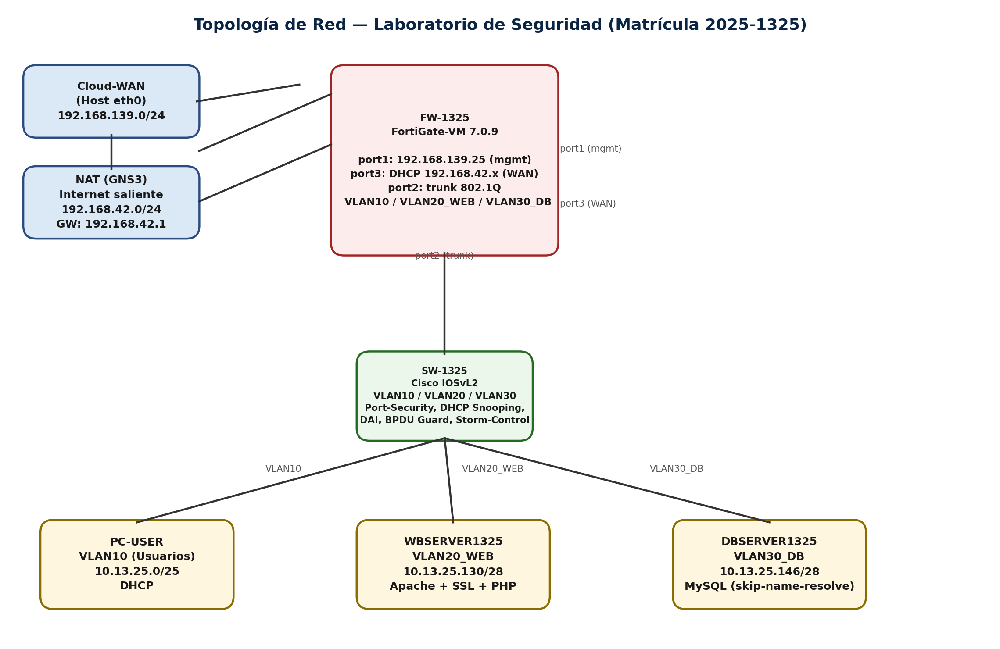
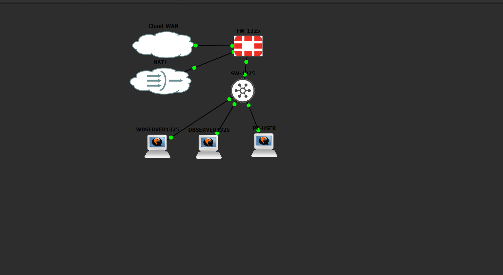
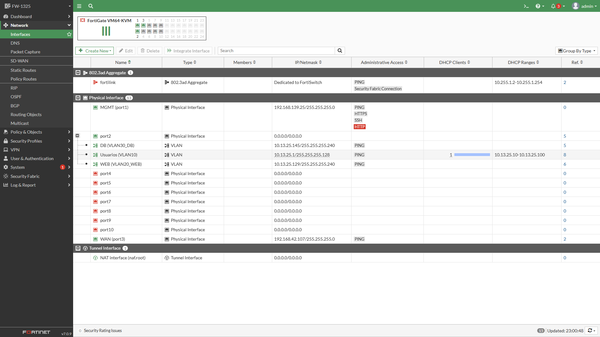
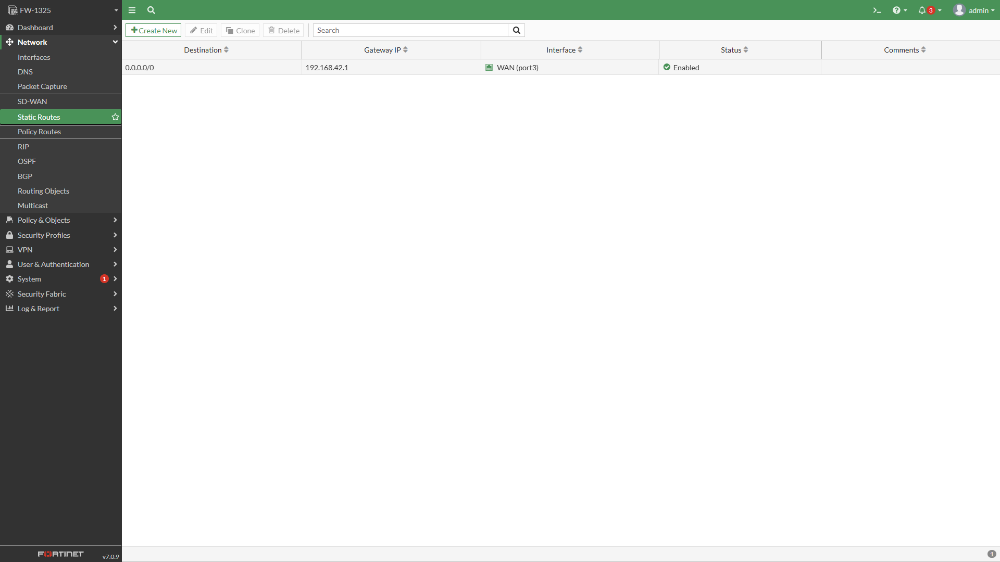
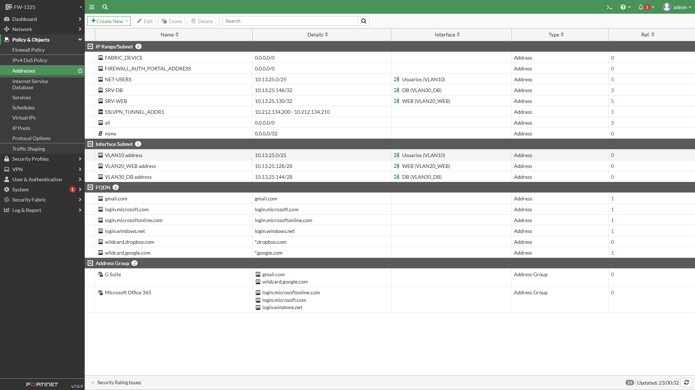
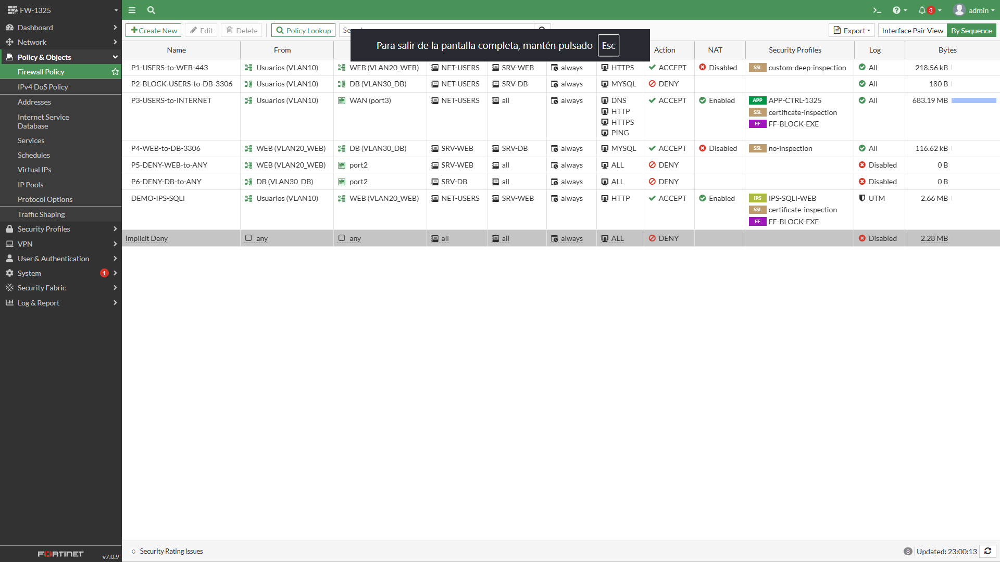
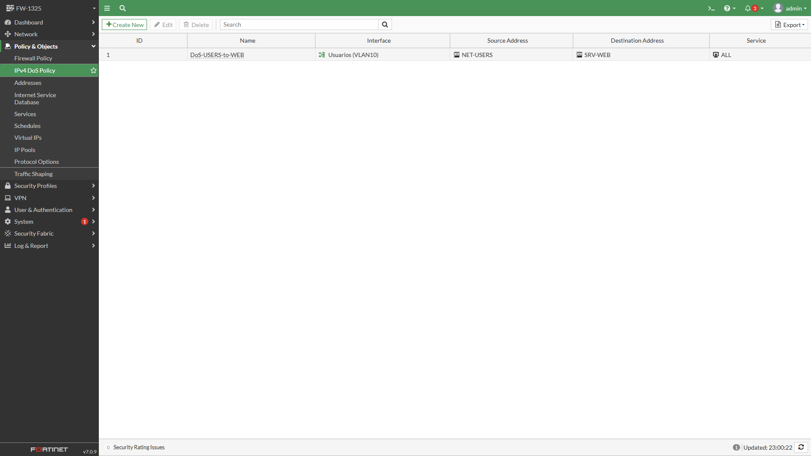
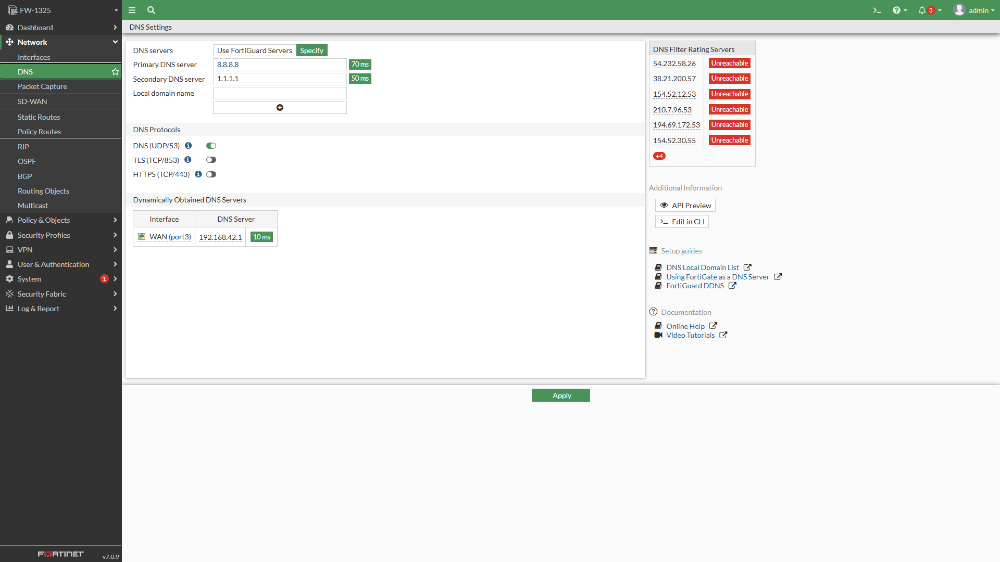
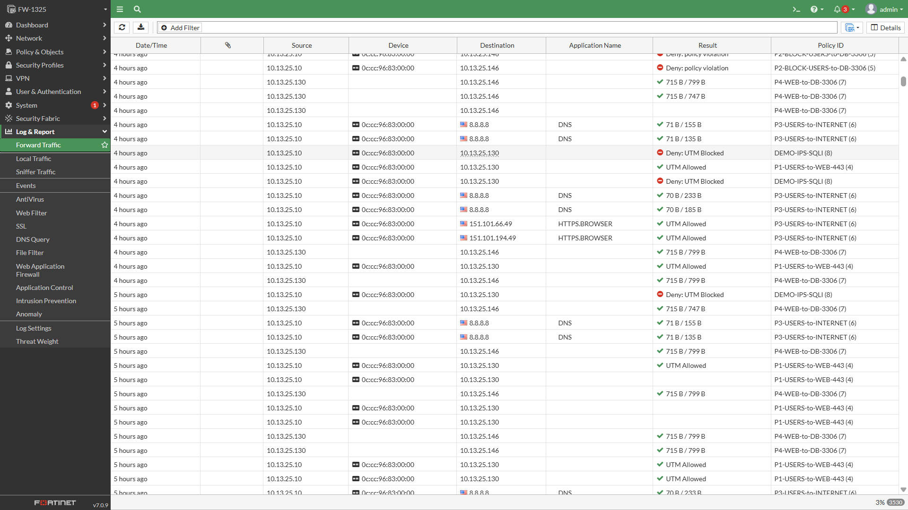

# Laboratorio de Seguridad en Redes — Firewall FortiGate con Segmentación VLAN

**Matrícula: 2025-1325**

## 🎬 Video de demostración

**[▶ Ver video de demostración](demo/video-demostracion.mp4)**

---

## 1. Propósito del Laboratorio

Este laboratorio implementa y valida, en un entorno simulado con GNS3, un firewall de próxima generación **FortiGate 7.0.9** que segmenta y protege una red compuesta por un switch de capa 2 con VLAN, un servidor web (HTTPS), un servidor de base de datos (MySQL) y una red de usuarios.

El objetivo es demostrar de forma práctica:

- Control de acceso entre segmentos (Usuarios → Web permitido; Usuarios → Base de Datos bloqueado).
- Inspección profunda de tráfico (DPI / Full SSL Inspection).
- Detección y **cuarentena automática** de un ataque de inyección SQL mediante una firma IPS personalizada.
- Restricción del servidor web para comunicarse con la base de datos **únicamente por el puerto 3306**.
- Bloqueo de descargas de archivos ejecutables (**.exe**).
- Mitigación de ataques de denegación de servicio (**DoS / rate limiting**).
- Segmentación y seguridad de capa 2 en el switch (port-security, DHCP snooping, DAI, BPDU Guard, storm-control).

Todo el direccionamiento IP se derivó de la matrícula del estudiante (**2025-1325**) y toda la configuración funcional del FortiGate se realizó por **GUI**, salvo la asignación inicial de la IP de gestión (único paso por CLI).

---

## 2. Topología de Red


*Diagrama lógico de la topología (elaboración propia).*


*Topología real en GNS3: Cloud-WAN, NAT1, FW-1325, SW-1325, WBSERVER1325, DBSERVER1325 y PC-USER.*

| Segmento | Red | Host(s) |
|---|---|---|
| VLAN10 – Usuarios | 10.13.25.0/25 | PC-USER (DHCP) |
| VLAN20_WEB | 10.13.25.128/28 | WBSERVER1325: 10.13.25.130 |
| VLAN30_DB | 10.13.25.144/28 | DBSERVER1325: 10.13.25.146 |
| WAN (port3) | 192.168.42.0/24 (DHCP) | Salida a Internet |
| Gestión (port1) | 192.168.139.0/24 | FW-1325: 192.168.139.25 |

---

## 3. Evidencia de Configuración (FortiGate GUI)

**Interfaces y VLAN** sobre el enlace troncal port2:



**Ruta por defecto** hacia Internet:



**Objetos de dirección** usados en las políticas:



**Políticas de firewall** (P1–P6 + DEMO-IPS-SQLI):



**Política de DoS** (rate limiting) sobre el servidor web:



**DNS** del FortiGate:



**Log real** confirmando el bloqueo de la inyección SQL (`Deny: UTM Blocked` en `DEMO-IPS-SQLI`), junto con tráfico normal aceptado por P1/P3/P4:



---

## 4. Scripts Utilizados

Todos los scripts están en [`/scripts`](scripts/):

| Archivo | Descripción |
|---|---|
| [`scripts/switch/switch-config.txt`](scripts/switch/switch-config.txt) | Configuración completa del switch SW-1325 (VLAN, port-security, DHCP snooping, DAI, BPDU Guard, storm-control) |
| [`scripts/fortigate/fw-1325-bootstrap.txt`](scripts/fortigate/fw-1325-bootstrap.txt) | Único comando CLI: IP de gestión de port1 |
| [`scripts/fortigate/ips-sqli-signatures.txt`](scripts/fortigate/ips-sqli-signatures.txt) | 4 firmas IPS personalizadas (F-SBID) para detección de SQL Injection |
| [`scripts/servers/db-server/netplan-01-lab.yaml`](scripts/servers/db-server/netplan-01-lab.yaml) | Red de DBSERVER1325 |
| [`scripts/servers/db-server/setup-mysql.sql`](scripts/servers/db-server/setup-mysql.sql) | Base de datos `tienda`, usuario `webuser` y ajuste `skip-name-resolve` |
| [`scripts/servers/web-server/netplan-01-lab.yaml`](scripts/servers/web-server/netplan-01-lab.yaml) | Red de WBSERVER1325 |
| [`scripts/servers/web-server/index.php`](scripts/servers/web-server/index.php) | Endpoint deliberadamente vulnerable, usado para la demo de SQL Injection |
| [`scripts/servers/web-server/generate_pe.py`](scripts/servers/web-server/generate_pe.py) | Genera un ejecutable PE32 real (`test_real.exe`) para probar el bloqueo de .exe |
| [`scripts/servers/pc-user/netplan-01-lab.yaml`](scripts/servers/pc-user/netplan-01-lab.yaml) | Cliente por DHCP en VLAN10 |

---

## 5. Running-Configs

- **Switch SW-1325:** [`configs/switch-running-config.txt`](configs/switch-running-config.txt) (configuración completa también en `scripts/switch/switch-config.txt`).
- **FortiGate FW-1325:** exportar el respaldo oficial desde `System → Firmware & Configuration → Backup Configuration` y subirlo como [`configs/FW-1325-backup.conf`](configs/FW-1325-backup-INSTRUCCIONES.txt) (ver instrucciones en ese archivo).

---

## 6. Estructura del Repositorio

```
/
├── README.md                     <- este archivo (video al inicio)
├── demo/
│   └── video-demostracion.mp4
├── docs/
│   └── Documentacion-2025-1325.pdf
├── images/                       <- capturas usadas en esta documentación
├── configs/
│   ├── switch-running-config.txt
│   └── FW-1325-backup.conf
└── scripts/
    ├── switch/switch-config.txt
    ├── fortigate/fw-1325-bootstrap.txt
    ├── fortigate/ips-sqli-signatures.txt
    └── servers/ (netplan, setup-mysql.sql, index.php, generate_pe.py)
```
