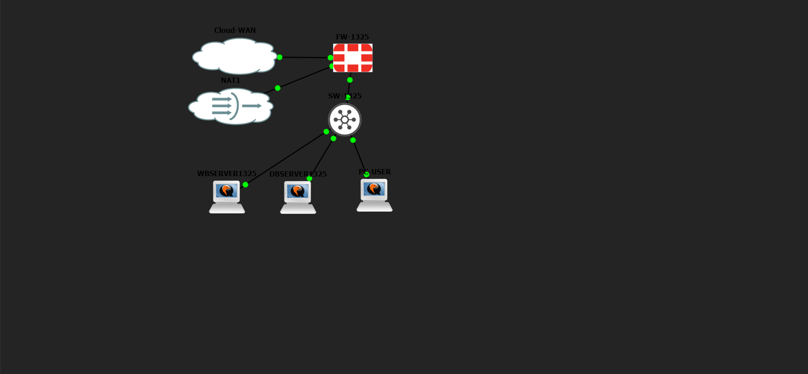
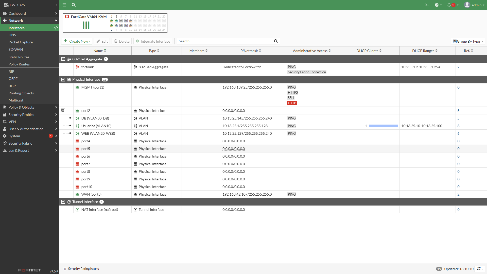
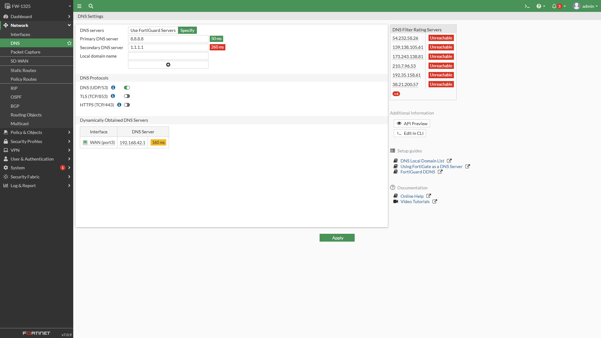
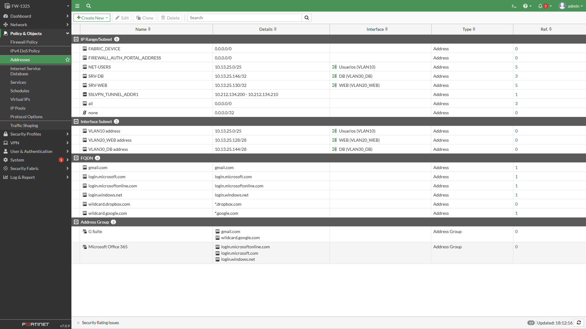
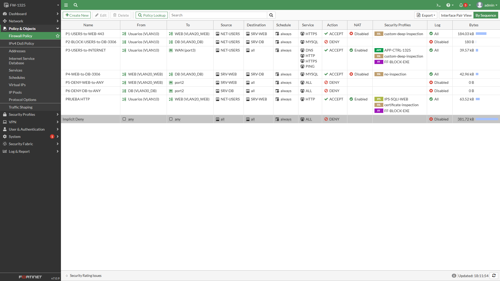
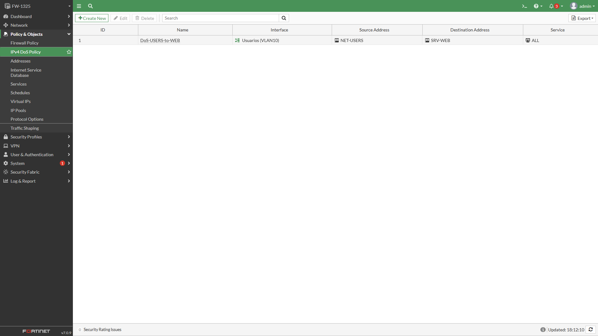
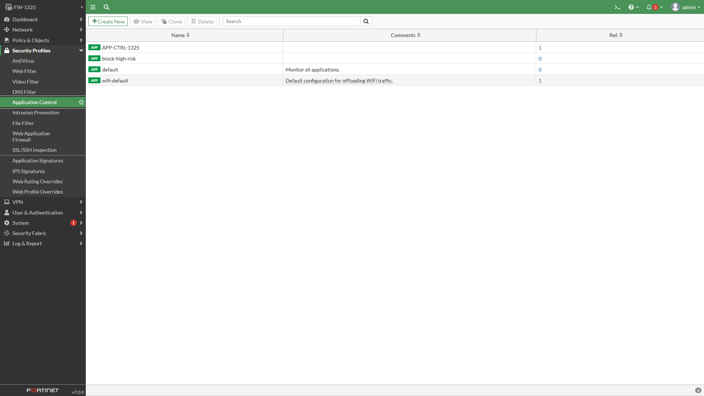
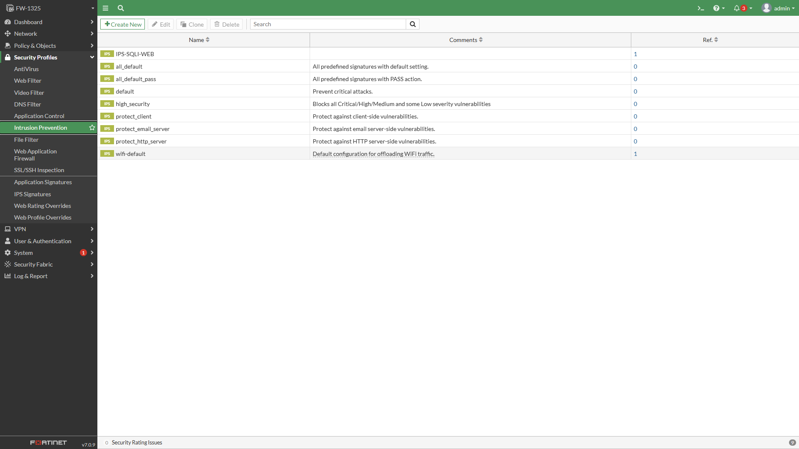
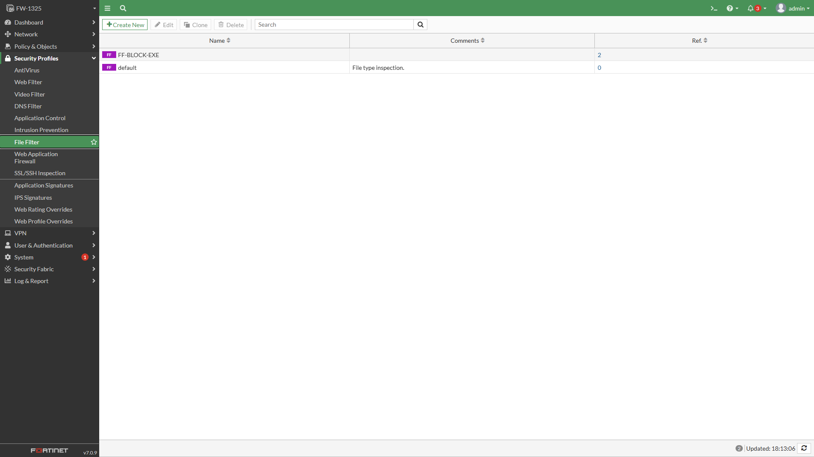
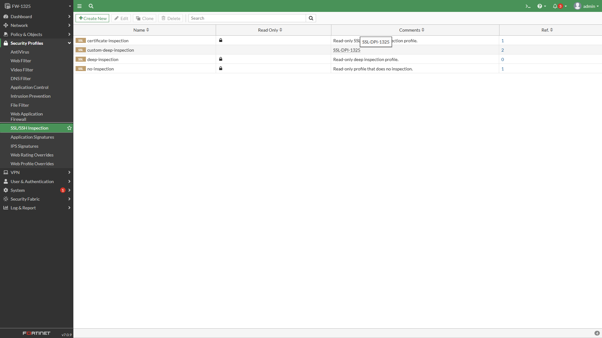

# Laboratorio de Seguridad en Redes — Firewall FortiGate con Segmentación VLAN

**Nombre:** Omar Paulino
**Matrícula:** 20251325

## Video de demostración

https://youtu.be/iJjrZ04i-tg

---

## 1. Propósito del laboratorio

Monté este laboratorio en GNS3 para implementar y comprobar, con un firewall de próxima generación real (**FortiGate 7.0.9**), la segmentación y protección de una red compuesta por un switch de capa 2 con VLAN, un servidor web, un servidor de base de datos y una red de usuarios. Todo el direccionamiento IP se derivó de mi matrícula (**2025-1325**), y toda la configuración funcional del FortiGate la hice por **GUI**, salvo la asignación inicial de la IP de gestión (único paso hecho por CLI).

Con esta topología demuestro, de forma práctica:

- Control de acceso entre segmentos (Usuarios → Web permitido; Usuarios → Base de Datos bloqueado explícitamente).
- Inspección profunda de tráfico (Full SSL Inspection / DPI) sobre HTTPS.
- Filtrado de aplicaciones (Application Control) sobre la salida a Internet.
- Detección y bloqueo automático de un ataque de **inyección SQL** mediante firmas IPS personalizadas.
- Bloqueo de descarga de archivos ejecutables (**File Filter**, extensión `.exe`).
- Mitigación de ataques de denegación de servicio (**IPv4 DoS Policy**, rate limiting sobre el servidor web).
- Segmentación y endurecimiento de capa 2 en el switch (port-security, DHCP snooping, DAI, BPDU Guard, storm-control).

## 2. Repositorio de GitHub

Este repositorio contiene toda la evidencia y el material del laboratorio en un único archivo (este documento) más su carpeta de imágenes, para que quede todo centralizado y fácil de revisar: video al inicio, propósito, topología con diagramas, evidencia de configuración con capturas reales de la GUI, todos los scripts que usé y las running-configs del switch.

## 3. Topología de red


*Diagrama lógico que dibujé de la topología: Cloud-WAN y NAT1 dan salida a Internet, el FortiGate concentra las VLAN sobre el enlace troncal hacia el switch, y de ahí cuelgan mis tres hosts.*

| Segmento | Red | Host(s) |
|---|---|---|
| VLAN10 – Usuarios | 10.13.25.0/25 | PC-USER (por DHCP) |
| VLAN20_WEB | 10.13.25.128/28 | WBSERVER1325: 10.13.25.130 |
| VLAN30_DB | 10.13.25.144/28 | DBSERVER1325: 10.13.25.146 |
| WAN (port3) | 192.168.42.0/24 (DHCP) | Salida a Internet |
| Gestión (port1) | 192.168.139.0/24 | FW-1325: 192.168.139.25 |

## 4. Evidencia de configuración (capturas de la GUI del FortiGate)

**Interfaces físicas y VLAN** sobre el enlace troncal (port2), más la interfaz de gestión (port1) y la WAN (port3):



**DNS** configurado en el FortiGate (servidores primario y secundario, más el DNS aprendido dinámicamente por la WAN):



**Ruta estática por defecto** hacia Internet, saliendo por WAN (port3):


**Objetos de dirección** que usé como origen/destino en mis políticas (NET-USERS, SRV-WEB, SRV-DB y las subredes de cada VLAN):



**Políticas de firewall** completas, en orden (P1 a P6, la política de prueba por HTTP, y el Implicit Deny al final):



**Política de DoS (IPv4 DoS Policy)** aplicada sobre el tráfico de Usuarios hacia el servidor web, para mitigar floods:



**Perfil de Application Control** (`APP-CTRL-1325`) que apliqué en la salida a Internet de los usuarios:



**Firmas de Intrusion Prevention (IPS)** — el perfil `IPS-SQLI-WEB` con las firmas personalizadas que detectan patrones de inyección SQL (`UNION SELECT`, `OR 1=1`, `SLEEP(`, `DROP TABLE`):



**Perfil de File Filter** (`FF-BLOCK-EXE`) que bloquea la descarga de archivos ejecutables por HTTP/HTTPS:



**Perfil de inspección SSL/SSH** (`custom-deep-inspection`) que uso para poder inspeccionar el tráfico HTTPS en profundidad (Full SSL Inspection) y así detectar tanto la inyección SQL como los archivos `.exe` incluso cifrados:



## 5. Scripts que utilicé

### 5.1 Switch SW-1325 — configuración completa (VLAN + seguridad de capa 2)

```
hostname SW-1325
!
vlan 10
 name USUARIOS
vlan 20
 name WEB
vlan 30
 name DB
vlan 999
 name NATIVE_UNUSED
!
ip dhcp snooping
ip dhcp snooping vlan 10,20,30
ip arp inspection vlan 10,20,30
!
interface GigabitEthernet0/0
 description Trunk hacia FW-1325 port2
 switchport trunk encapsulation dot1q
 switchport trunk native vlan 999
 switchport trunk allowed vlan 10,20,30
 switchport mode trunk
 ip dhcp snooping trust
 no shutdown
!
interface GigabitEthernet0/1
 description Acceso PC-USER (VLAN10)
 switchport mode access
 switchport access vlan 10
 switchport port-security
 switchport port-security maximum 1
 switchport port-security mac-address sticky
 switchport port-security violation shutdown
 storm-control broadcast level 20.00
 storm-control multicast level 20.00
 spanning-tree portfast
 spanning-tree bpduguard enable
 no shutdown
!
interface GigabitEthernet0/2
 description Acceso WBSERVER1325 (VLAN20)
 switchport mode access
 switchport access vlan 20
 switchport port-security
 switchport port-security maximum 1
 switchport port-security mac-address sticky
 switchport port-security violation shutdown
 storm-control broadcast level 20.00
 spanning-tree portfast
 spanning-tree bpduguard enable
 no shutdown
!
interface GigabitEthernet0/3
 description Acceso DBSERVER1325 (VLAN30)
 switchport mode access
 switchport access vlan 30
 switchport port-security
 switchport port-security maximum 1
 switchport port-security mac-address sticky
 switchport port-security violation shutdown
 storm-control broadcast level 20.00
 spanning-tree portfast
 spanning-tree bpduguard enable
 no shutdown
!
end
```

### 5.2 FortiGate — bootstrap CLI inicial (único paso por CLI)

```
config system interface
    edit "port1"
        set mode static
        set ip 192.168.139.25 255.255.255.0
        set allowaccess ping https ssh http
    next
end
```

### 5.3 Firmas IPS personalizadas (SQL Injection)

```
F-SBID( --name "SQLi.Custom.UNION.SELECT"; --protocol tcp; --service HTTP;
  --pattern "UNION SELECT"; --no_case; --context uri;
  --attack_id 1000001; --severity high; )

F-SBID( --name "SQLi.Custom.OR.1equals1"; --protocol tcp; --service HTTP;
  --pattern "OR 1=1"; --no_case; --context uri;
  --attack_id 1000002; --severity high; )

F-SBID( --name "SQLi.Custom.SLEEP.Injection"; --protocol tcp; --service HTTP;
  --pattern "SLEEP("; --no_case; --context uri;
  --attack_id 1000003; --severity high; )

F-SBID( --name "SQLi.Custom.DROP.TABLE"; --protocol tcp; --service HTTP;
  --pattern "DROP TABLE"; --no_case; --context uri;
  --attack_id 1000004; --severity critical; )
```
*Aplicadas en el sensor `IPS-SQLI-WEB` con acción Block, dentro de mis políticas de acceso al servidor web.*

### 5.4 Servidor de Base de Datos (DBSERVER1325)

**Red** (`/etc/netplan/01-lab.yaml`):
```yaml
network:
  version: 2
  ethernets:
    ens3:
      addresses: [10.13.25.146/28]
      routes:
        - to: default
          via: 10.13.25.145
      nameservers:
        addresses: [8.8.8.8, 1.1.1.1]
```

**Base de datos MySQL:**
```sql
CREATE DATABASE tienda;
CREATE TABLE productos (id INT AUTO_INCREMENT PRIMARY KEY, nombre VARCHAR(100), precio DECIMAL(10,2));
CREATE TABLE usuarios  (id INT AUTO_INCREMENT PRIMARY KEY, username VARCHAR(50), password VARCHAR(255));
INSERT INTO productos (nombre, precio) VALUES ('Laptop', 850.00), ('Mouse', 19.99), ('Teclado', 45.50);

CREATE USER 'webuser'@'10.13.25.130' IDENTIFIED BY 'Web1325!Pass';
GRANT SELECT, INSERT, UPDATE ON tienda.* TO 'webuser'@'10.13.25.130';
FLUSH PRIVILEGES;

-- /etc/mysql/mysql.conf.d/mysqld.cnf
-- bind-address = 10.13.25.146
-- skip-name-resolve   (evita el retraso de resolución DNS reversa en cada conexión)
```

### 5.5 Servidor Web (WBSERVER1325)

**Red** (`/etc/netplan/01-lab.yaml`):
```yaml
network:
  version: 2
  ethernets:
    ens3:
      addresses: [10.13.25.130/28]
      mtu: 1300
      routes:
        - to: default
          via: 10.13.25.129
      nameservers:
        addresses: [8.8.8.8, 1.1.1.1]
```

**`index.php`** (endpoint deliberadamente vulnerable, usado para la demo de SQL Injection):
```php
<?php
$conn = new mysqli('10.13.25.146', 'webuser', 'Web1325!Pass', 'tienda');
if ($conn->connect_error) {{
    die('Error DB: ' . $conn->connect_error);
}}
$id = $_GET['id'] ?? '1';
$sql = "SELECT * FROM productos WHERE id = $id"; // vulnerable a proposito
$result = $conn->query($sql);
echo '<h2>WEB-SERVER 2025-1325</h2>';
while ($row = $result->fetch_assoc()) {{
    echo "{{$row['id']}} | {{$row['nombre']}} | {{$row['precio']}}<br>";
}}
?>
```

**Generador del archivo ejecutable de prueba** (crea un `.exe` con header PE real para probar el bloqueo por File Filter):
```python
import struct

dos_header = b'MZ' + b'\x90\x00' * 30 + struct.pack('<I', 0x80)
dos_header = dos_header[:0x3C] + struct.pack('<I', 0x80) + dos_header[0x40:]
dos_header = dos_header.ljust(0x80, b'\x00')

pe_sig = b'PE\x00\x00'
coff_header = struct.pack('<HHIIIHH', 0x8664, 1, 0, 0, 0, 0xF0, 0x0102)
optional_header = b'\x0b\x02' + b'\x00' * 238

with open('test_real.exe', 'wb') as f:
    f.write(dos_header + pe_sig + coff_header + optional_header)
    f.write(b'\x00' * 1000)
```

### 5.6 Cliente de usuario (PC-USER)

```yaml
network:
  version: 2
  ethernets:
    ens3:
      dhcp4: true
```
