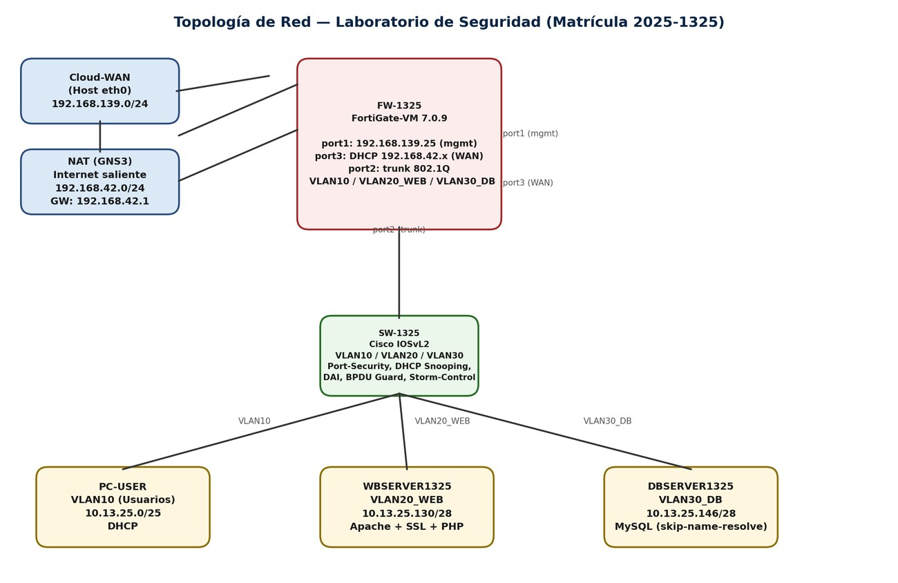
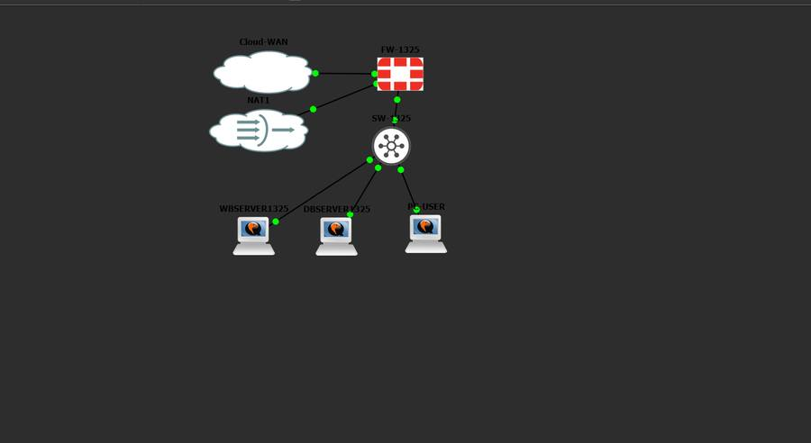
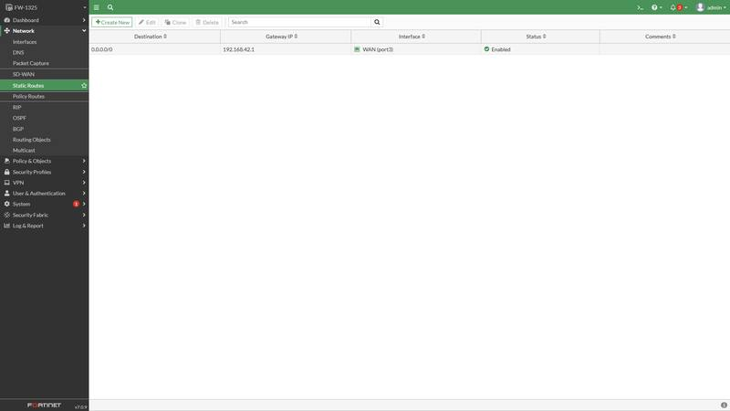
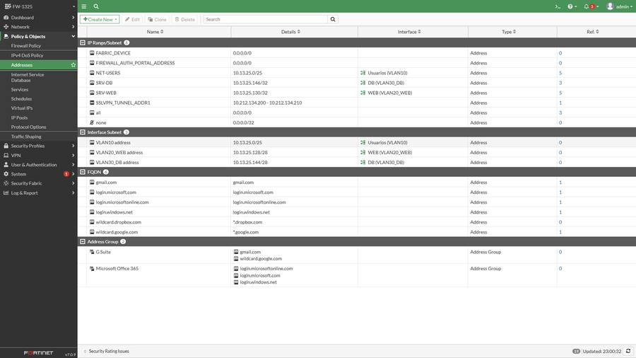
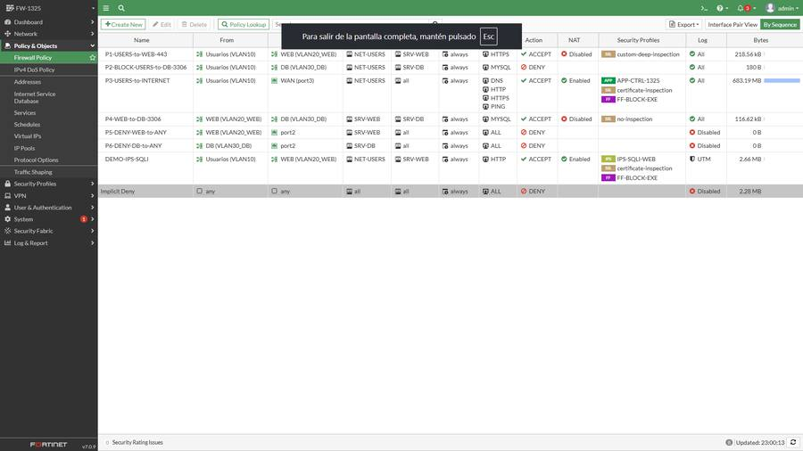
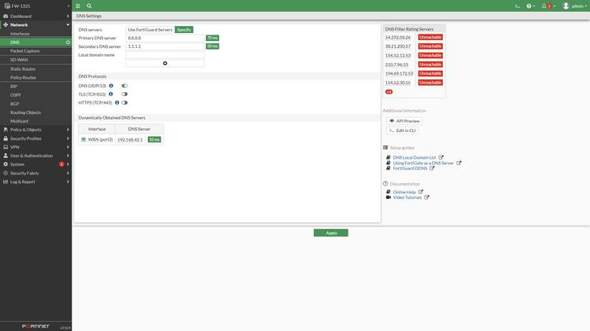
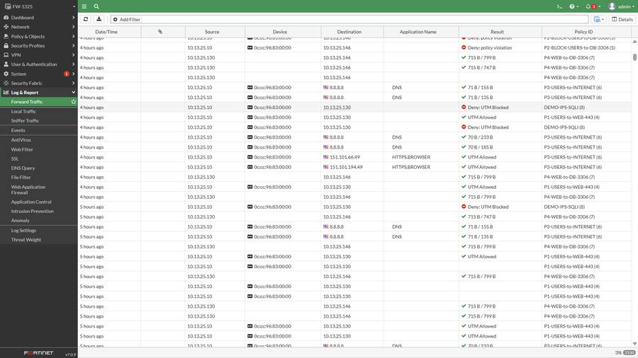

# Laboratorio de Seguridad en Redes — Firewall FortiGate con Segmentación VLAN

**Matrícula: 2025-1325**

## Video de demostración

**[Ver video de demostración](video-demostracion.mp4)**
*(sube tu archivo `video-demostracion.mp4` en esta misma carpeta del repositorio; GitHub no permite incrustar video dentro de un Markdown, así que va como archivo aparte enlazado aquí, al inicio del repo).*

---

## 1. Propósito del Laboratorio

Este laboratorio implementa y valida, en un entorno simulado con GNS3, un firewall de próxima generación **FortiGate 7.0.9** que segmenta y protege una red compuesta por un switch de capa 2 con VLAN, un servidor web (HTTPS), un servidor de base de datos (MySQL) y una red de usuarios.

El objetivo es demostrar de forma práctica:

- Control de acceso entre segmentos (Usuarios → Web permitido; Usuarios → Base de Datos bloqueado).
- Inspección profunda de tráfico (DPI / Full SSL Inspection).
- Detección y **cuarentena automática** de un ataque de inyección SQL mediante una firma IPS personalizada.
- Restricción del servidor web para comunicarse con la base de datos **únicamente por el puerto 3306**.
- Bloqueo de descargas de archivos ejecutables (**.exe**).
- Mitigación de ataques de denegación de servicio (**DoS / rate limiting**).
- Segmentación y seguridad de capa 2 en el switch (port-security, DHCP snooping, DAI, BPDU Guard, storm-control).

Todo el direccionamiento IP se derivó de la matrícula del estudiante (**2025-1325**) y toda la configuración funcional del FortiGate se realizó por **GUI**, salvo la asignación inicial de la IP de gestión (único paso por CLI).

---

## 2. Topología de Red



*Diagrama lógico de la topología (elaboración propia).*



*Topología real en GNS3: Cloud-WAN, NAT1, FW-1325, SW-1325, WBSERVER1325, DBSERVER1325 y PC-USER.*

| Segmento | Red | Host(s) |
|---|---|---|
| VLAN10 – Usuarios | 10.13.25.0/25 | PC-USER (DHCP) |
| VLAN20_WEB | 10.13.25.128/28 | WBSERVER1325: 10.13.25.130 |
| VLAN30_DB | 10.13.25.144/28 | DBSERVER1325: 10.13.25.146 |
| WAN (port3) | 192.168.42.0/24 (DHCP) | Salida a Internet |
| Gestión (port1) | 192.168.139.0/24 | FW-1325: 192.168.139.25 |

---

## 3. Evidencia de Configuración (FortiGate GUI)

**Interfaces y VLAN** sobre el enlace troncal port2:


**Ruta por defecto** hacia Internet:



**Objetos de dirección** usados en las políticas:



**Políticas de firewall** (P1–P6 + DEMO-IPS-SQLI):



**Política de DoS** (rate limiting) sobre el servidor web:


**DNS** del FortiGate:



**Log real** confirmando el bloqueo de la inyección SQL (`Deny: UTM Blocked` en `DEMO-IPS-SQLI`), junto con tráfico normal aceptado por P1/P3/P4:



---

## 4. Scripts y Running-Config del Switch

### 4.1 Switch SW-1325 — running-config completo (VLAN + seguridad de capa 2)

```
hostname SW-1325
!
vlan 10
 name USUARIOS
vlan 20
 name WEB
vlan 30
 name DB
vlan 999
 name NATIVE_UNUSED
!
ip dhcp snooping
ip dhcp snooping vlan 10,20,30
ip arp inspection vlan 10,20,30
!
interface GigabitEthernet0/0
 description Trunk hacia FW-1325 port2
 switchport trunk encapsulation dot1q
 switchport trunk native vlan 999
 switchport trunk allowed vlan 10,20,30
 switchport mode trunk
 ip dhcp snooping trust
 no shutdown
!
interface GigabitEthernet0/1
 description Acceso PC-USER (VLAN10)
 switchport mode access
 switchport access vlan 10
 switchport port-security
 switchport port-security maximum 1
 switchport port-security mac-address sticky
 switchport port-security violation shutdown
 storm-control broadcast level 20.00
 storm-control multicast level 20.00
 spanning-tree portfast
 spanning-tree bpduguard enable
 no shutdown
!
interface GigabitEthernet0/2
 description Acceso WBSERVER1325 (VLAN20)
 switchport mode access
 switchport access vlan 20
 switchport port-security
 switchport port-security maximum 1
 switchport port-security mac-address sticky
 switchport port-security violation shutdown
 storm-control broadcast level 20.00
 spanning-tree portfast
 spanning-tree bpduguard enable
 no shutdown
!
interface GigabitEthernet0/3
 description Acceso DBSERVER1325 (VLAN30)
 switchport mode access
 switchport access vlan 30
 switchport port-security
 switchport port-security maximum 1
 switchport port-security mac-address sticky
 switchport port-security violation shutdown
 storm-control broadcast level 20.00
 spanning-tree portfast
 spanning-tree bpduguard enable
 no shutdown
!
end
```

*(Guardado en el equipo real con `copy running-config startup-config` antes de apagar los nodos en GNS3 — la running-config de un IOS vive en RAM y se pierde si no se confirma ese guardado; esto no aplica al FortiGate ni a los servidores Ubuntu, cuyo estado persiste en disco).*

### 4.2 FortiGate — bootstrap CLI inicial (único paso por CLI)

```
config system interface
    edit "port1"
        set mode static
        set ip 192.168.139.25 255.255.255.0
        set allowaccess ping https ssh http
    next
end
```

### 4.3 Firmas IPS personalizadas (SQL Injection)

```
F-SBID( --name "SQLi.Custom.UNION.SELECT"; --protocol tcp; --service HTTP;
  --pattern "UNION SELECT"; --no_case; --context uri;
  --attack_id 1000001; --severity high; )

F-SBID( --name "SQLi.Custom.OR.1equals1"; --protocol tcp; --service HTTP;
  --pattern "OR 1=1"; --no_case; --context uri;
  --attack_id 1000002; --severity high; )

F-SBID( --name "SQLi.Custom.SLEEP.Injection"; --protocol tcp; --service HTTP;
  --pattern "SLEEP("; --no_case; --context uri;
  --attack_id 1000003; --severity high; )

F-SBID( --name "SQLi.Custom.DROP.TABLE"; --protocol tcp; --service HTTP;
  --pattern "DROP TABLE"; --no_case; --context uri;
  --attack_id 1000004; --severity critical; )
```
*Sensor IPS: `IPS-SQLI-WEB` → acción Block + Quarantine (Attacker's IP Address), aplicado en la política `DEMO-IPS-SQLI`.*

### 4.4 Servidor de Base de Datos (DBSERVER1325)

**Red** (`/etc/netplan/01-lab.yaml`):
```yaml
network:
  version: 2
  ethernets:
    ens3:
      addresses: [10.13.25.146/28]
      routes:
        - to: default
          via: 10.13.25.145
      nameservers:
        addresses: [8.8.8.8, 1.1.1.1]
```

**Base de datos MySQL:**
```sql
CREATE DATABASE tienda;
CREATE TABLE productos (id INT AUTO_INCREMENT PRIMARY KEY, nombre VARCHAR(100), precio DECIMAL(10,2));
CREATE TABLE usuarios  (id INT AUTO_INCREMENT PRIMARY KEY, username VARCHAR(50), password VARCHAR(255));
INSERT INTO productos (nombre, precio) VALUES ('Laptop', 850.00), ('Mouse', 19.99), ('Teclado', 45.50);

CREATE USER 'webuser'@'10.13.25.130' IDENTIFIED BY 'Web1325!Pass';
GRANT SELECT, INSERT, UPDATE ON tienda.* TO 'webuser'@'10.13.25.130';
FLUSH PRIVILEGES;

-- /etc/mysql/mysql.conf.d/mysqld.cnf
-- bind-address = 10.13.25.146
-- skip-name-resolve   (fix de latencia de conexion, ~10.2s -> ~0.12s)
```

### 4.5 Servidor Web (WBSERVER1325)

**Red** (`/etc/netplan/01-lab.yaml`):
```yaml
network:
  version: 2
  ethernets:
    ens3:
      addresses: [10.13.25.130/28]
      mtu: 1300
      routes:
        - to: default
          via: 10.13.25.129
      nameservers:
        addresses: [8.8.8.8, 1.1.1.1]
```

**`index.php`** (endpoint deliberadamente vulnerable, usado para la demo de SQL Injection):
```php
<?php
$conn = new mysqli('10.13.25.146', 'webuser', 'Web1325!Pass', 'tienda');
if ($conn->connect_error) {
    die('Error DB: ' . $conn->connect_error);
}
$id = $_GET['id'] ?? '1';
$sql = "SELECT * FROM productos WHERE id = $id"; // vulnerable a proposito
$result = $conn->query($sql);
echo '<h2>WEB-SERVER 2025-1325</h2>';
while ($row = $result->fetch_assoc()) {
    echo "{$row['id']} | {$row['nombre']} | {$row['precio']}<br>";
}
?>
```

**`generate_pe.py`** (genera un ejecutable PE32 real para probar el bloqueo de `.exe`):
```python
import struct
dos_stub = b'MZ' + b'\x90' * 58 + struct.pack('<I', 0x80)
dos_stub = dos_stub.ljust(0x80, b'\x00')
pe_sig = b'PE\x00\x00'
coff_header = struct.pack('<HHIIIHH', 0x014c, 1, 0, 0, 0, 0xE0, 0x0102)
optional_header = b'\x0b\x01' + b'\x00' * 94
with open('test_real.exe', 'wb') as f:
    f.write(dos_stub + pe_sig + coff_header + optional_header + b'\x00' * 256)
```

### 4.6 Cliente de Usuario (PC-USER)

```yaml
network:
  version: 2
  ethernets:
    ens3:
      dhcp4: true
```
